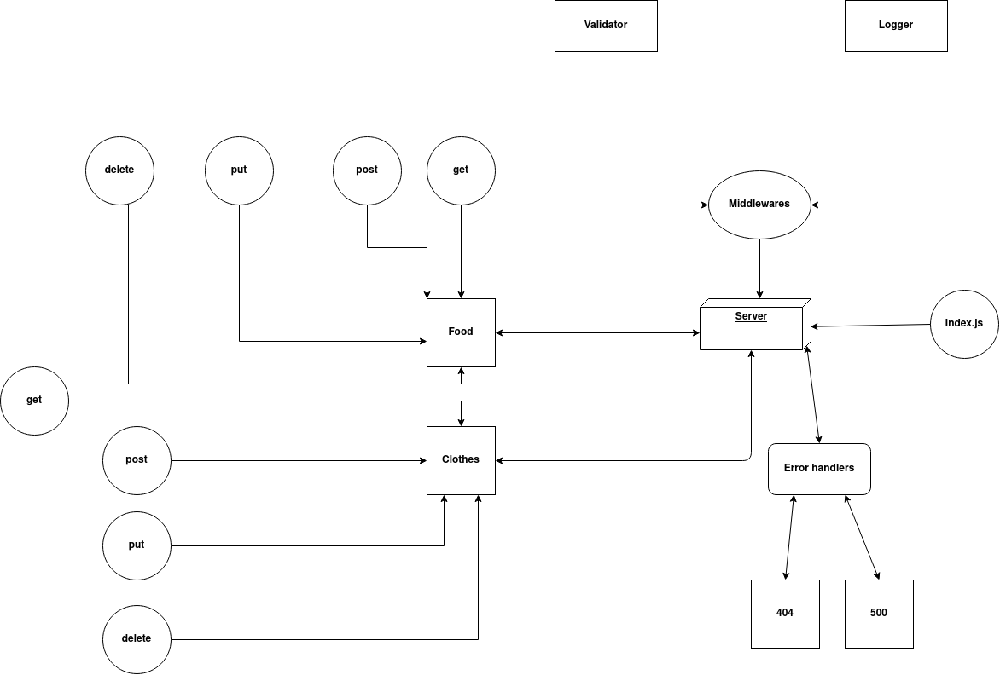

# basic-api-server

## About

A REST Express API, has various endpoints like ***/food*** and ***/clothes*** , both endpoints can perform CRUD operations on a Mongo Database, using the REST standards .
It has 2 data models and 2 routers : clothes and food.

<hr>

## Author

Amjad Mesmar

<hr>

## Links

*(Submission Pull Request)[https://github.com/AmjadMesmar/api-server/pull/1]
* (Deployed App)[https://souls-api-server.herokuapp.com/]
* (Action Report)[https://github.com/AmjadMesmar/api-server/actions]

<hr>

## Setup

1. `(.env)` file

```
PORT=5000
```

2. Install the following dependencies

```
npm i cors dotenv express morgan mongoose
npm i -D jest supertest
mongod --dbpath=/Users/path/to/data/db
```

## Running the app

1. clone the repo.
2. Enter the command `npm start`
3. Use endpoints :

## Food

### * `/api/v1/food`

<br>

- **Method** : GET
- **CRUD Operation** : Read / Gets All Food Records
- **Response Body**   : JSON

```
[
    {
        "_id": "60a5938ee109aa218e6f5a6f",
        "main": "mansaf",
        "soup": "chicken",
        "__v": 0
    },
    {
        "_id": "60a5945ce109aa218e6f5a70",
        "main": "mansaf",
        "soup": "meat",
        "__v": 0
    }
]
```
<br>

### * `/api/v1/food`

- **Method** : POST
- **CRUD Operation** : Create / Add a Record
- **Response Body**   : JSON

```
    {
        "_id": "60a5938ee109aa218e6f5a6f",
        "main": "mansaf",
        "soup": "chicken",
        "__v": 0
    }
```
<br>

### * `/api/v1/food/id`

<br>

- **Method** : GET
- **CRUD Operation** : Read / Get One Record
- **Response Body**   : JSON

```
    {
        "_id": "60a5938ee109aa218e6f5a6f",
        "main": "mansaf",
        "soup": "chicken",
        "__v": 0
    }
```
<br>

### * `/api/v1/food/id`

- **Method** : PUT
- **CRUD Operation** : UPDATE / Update a Record
- **Response Body**   : JSON

```
    {
        "_id": "60a5938ee109aa218e6f5a6f",
        "top": "mansaf",
        "bottom": "healthy",
        "__v": 0
    }
```
<br>

### * `/api/v1/food`

- **Method** : DELETE
- **CRUD Operation** : DELETE / Delete a Record
- **Response Body**   : JSON

```
    {
        "_id": "60a5938ee109aa218e6f5a6f",
        "top": "mansaf",
        "bottom": "healthy",
        "__v": 0
    }
```

<br><br><br>
<hr>
<br><br>

## Clothes

### *`/api/v1/clothes`

<br>

- **Method** : GET
- **CRUD Operation** : Read / Gets All clothes Records
- **Response Body**  : JSON

```
[
    {
        "_id": "60a5938ee109aa218e6f5a6f",
        "top": "t-shirt",
        "bottom": "jeans",
        "__v": 0
    },
    {
        "_id": "60a5945ce109aa218e6f5a70",
        "top": "socks",
        "bottom": "jeans",
        "__v": 0
    }
]
```

<br>

### *`/api/v1/clothes`

- **Method** : POST
- **CRUD Operation** : Create / Add a Record
- **Response Body**   : JSON

```
{
    "top":"socks",
    "bottom":"jeans"
}
```

<br>

### * `/api/v1/clothes/id`

<br>

- **Method** : GET
- **CRUD Operation** : Read / Get One Record
- **Response Body** : JSON

```
 {
        "_id": "60a5938ee109aa218e6f5a6f",
        "top": "t-shirt",
        "bottom": "jeans",
        "__v": 0
    }
```

<br>

### * `/api/v1/clothes/id`

<br>

- **Method** : PUT
- **CRUD Operation** : UPDATE / Update a Record
- **Response Body**  : JSON

```
 {
        "_id": "60a5938ee109aa218e6f5a6f",
        "top": "t-shirt",
        "bottom": "ears",
        "__v": 0
    }
```

<br>

### * `/api/v1/clothes/id`

<br>

- **Method** : DELETE
- **CRUD Operation** : DELETE / Delete a Record
- **Response Body**   : JSON

```
 {
     "_id": "60a5938ee109aa218e6f5a6f",
     "top": "t-shirt",
     "bottom": "ears",
      "__v": 0
    }
```

4. Test:

* There's 2 test files . logger.test.js and server.test.js
* In terminal run :

```

npm test

```

<br><br><br>
<hr>
<br><br>

## UML Diagram


